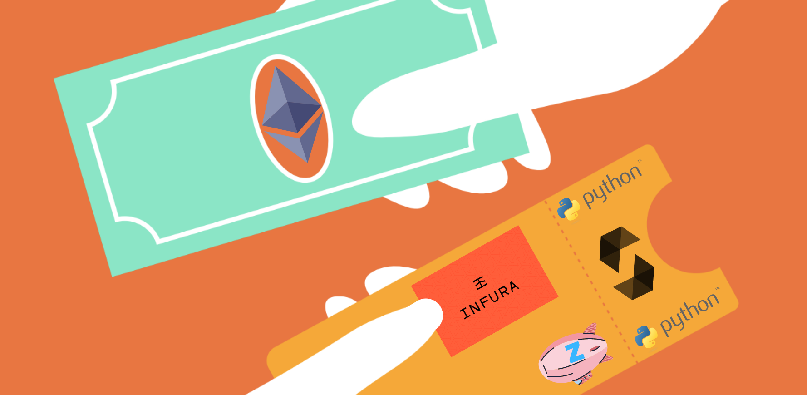
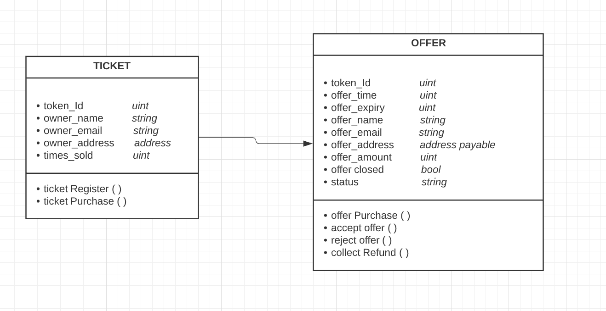
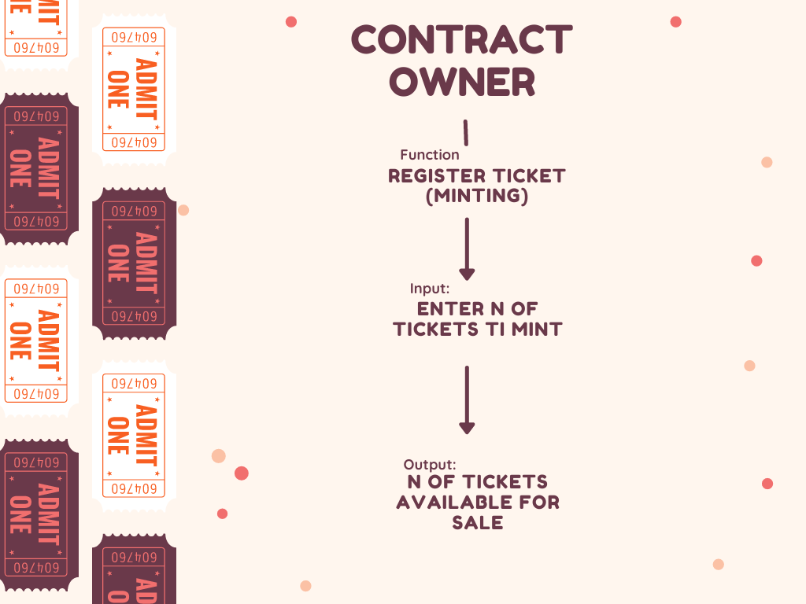
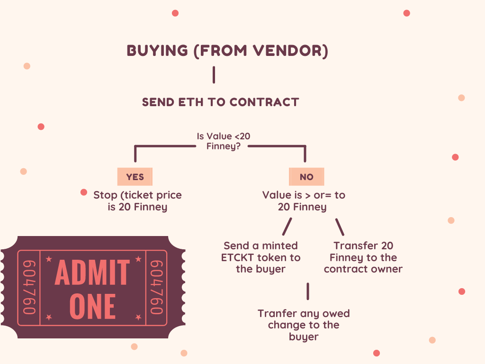
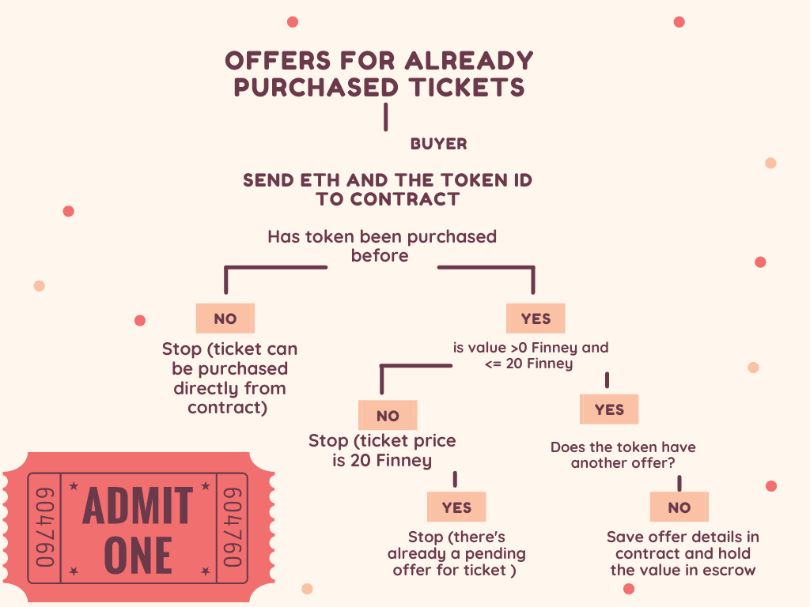
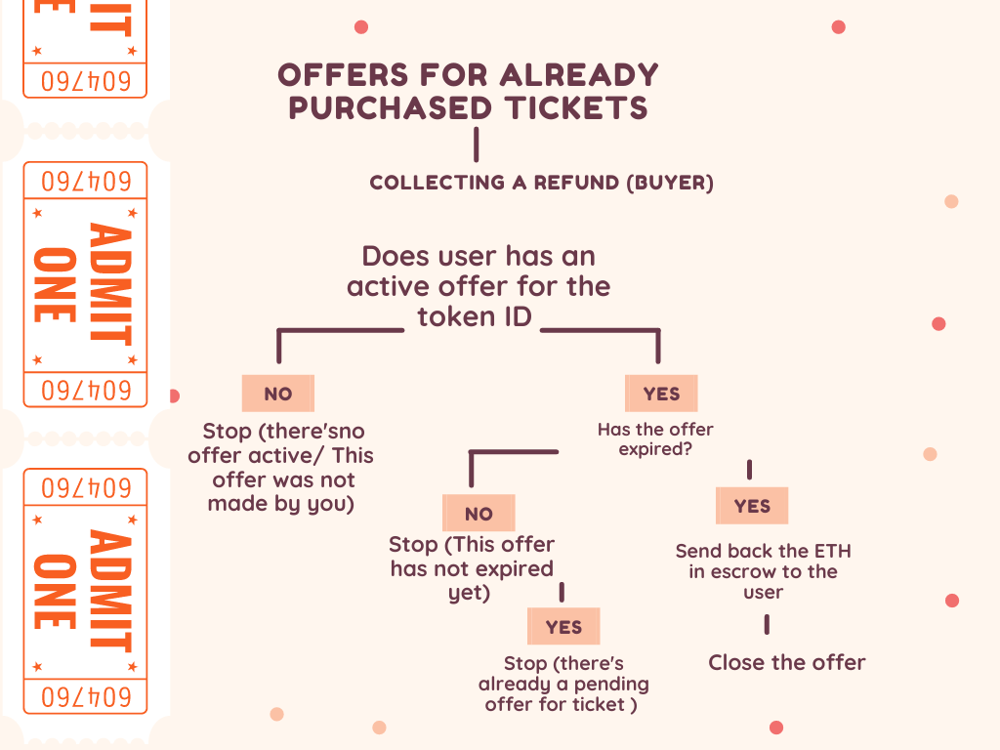
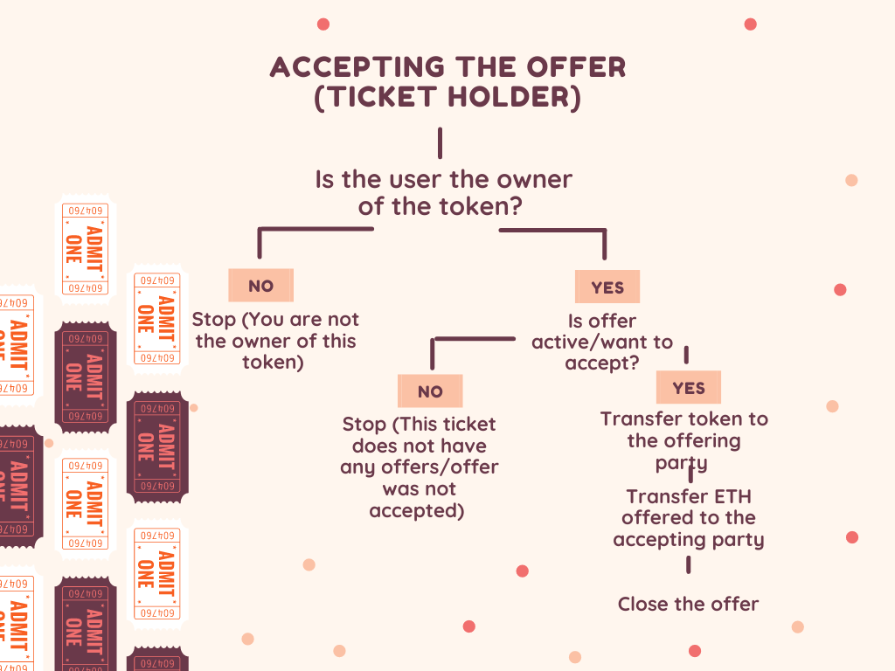
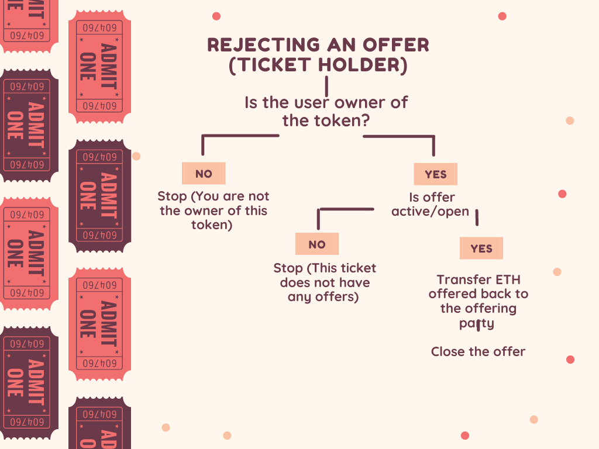

# EventTicket: Decentralized Event Ticketing System  

# Contents:

- [OBJECTIVE](#objective)

- [TECHNOLOGIES](#technologies)

- [VIDEO DEMO](#video-demo)
   
- [FUNCTIONS](#functions)

	- [Ticket Registration (Minting)](#minting)
	- [Buying a ticket from the vendor](#Buying-a-ticket-from-the-vendor)
	- [Buying a ticket from another user](#Buying-a-ticket-from-another-user)
	- [Collecting a refund](#Collecting-a-refund)
	- [Accepting an offer from another user](#Accepting-an-offer-from-another-user)
	- [Rejecting an offer](#Rejecting-an-offer)

### Objective:

EventTicket is a decentralized application that offers a blockchain solution for ticket providers. It offers customers the benefits and security of the ERC-721 standard. In our system, an NFT represents an event ticket (ETCKT token) which is essentially transferred to the purchaser. The system also allows potential buyers to purchase tickets that have already been purchased, directly from the owner. Purchase offers can be controlled by limiting the amount of resales for a particular event and the price increases can be set by the event organizers to limit or control ticket scalping. 

### Technologies, platforms and libraries used:

- Solidity
- Remix
- OpenZeppelin
- Python
- Jupyter notebook
- web3 py
- Infura
- Rinkeby testnet
- Ganache
- Metamask

---
## Video Demo
[HERE](https://youtu.be/Ih6cbqdMljA)

---

## UML:

---

## Process flow:

###  Minting

###  Buying a ticket from the vendor

###  Buying a ticket from another user

###  Collecting a refund

###  Accepting an offer from another user

###  Rejecting an offer

## Deployment:

1) Compile and deploy the [contract](EventTicket/EventTicket.sol) on the Rinkeby testnet using Remix.

2) Copy the address of the contract and paste it under EVENTTICKET_ADDRESS in [env.txt](EventTicket/env.txt).

3) Copy the private key of the account you used to deploy your contract and paste it under ACCT_PRIV_KEY in [env.txt](EventTicker/env.txt).

4) Rename the env.txt file to .env

5) Run jupyter notebook and open the [EventTicket](EventTicket/EventTicket.ipynb) notebook.

6) Once connected, try to run thorugh the purchase scenarios from the process flows above. Enjoy!

7) If interested in how web3 is helping us connect to the contract on the blockchain, have a look through our helper code [ticket.py](EventTicket/ticket.py) here.
